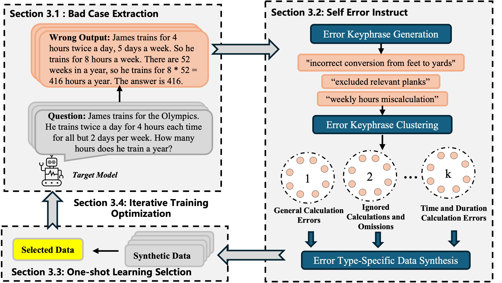

# Overview
This repository contains the code and dataset for the ACL ARR submission: "Self-Error-Instruct: Generalizing from Errors for LLMs Mathematical Reasoning"

## Framework

The figure illustrates our Self-Error-Instruct framework, which consists of four key steps: (1) Bad Case Extraction, where failure cases are identified from the target model. (2) Self-Error-Instruct, which generates error keyphrases, performs clustering, and synthesizes data tailored for each error type. (3) One-Shot Learning Data Selection, which filters and retains only high-quality and effective examples for training. (4) Iterative Training, where the target model is refined by fine-tuning it with the curated data and repeating the process to achieve further performance improvements.

